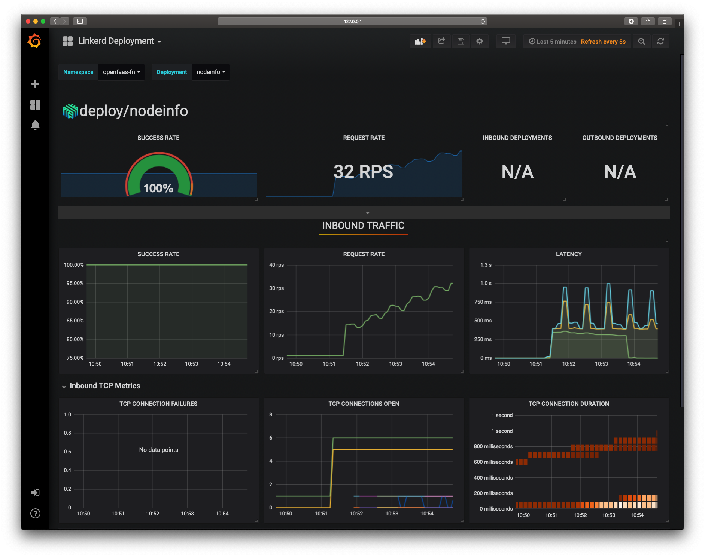

Guide for OpenFaaS / Linkerd2
=============================================

[Linkerd 2](https://linkerd.io/2/) is a service mesh that provides features such as:
* Mutual TLS between gateway, ingress and functions *
* Dashboard and pre-configured grafana dashboards with prometheus metrics,
* Works along-side ingress controllers,
* Retries and timeouts,
* Telemetry and monitoring,
* A lot more! [Checkout the documentation](https://linkerd.io/2/features/)

One of the goals for Linkerd2 is that *it just works*. Is an operator-friendly project just like OpenFaaS! :smile:

Today we will install Linkerd to our Kubernetes cluster so that the communication between the Gateway and the Functions goes through the linkerd proxy. These will give us encrypted communication, retries, timeouts and more.

Be sure to have a working OpenFaaS installation on top of a Kubernetes cluster.

If you are running on a GKE cluster with RBAC enabled you need to grant a cluster role of cluster-admin to your Google account:
```bash
kubectl create clusterrolebinding cluster-admin-binding-$USER \
    --clusterrole=cluster-admin --user=$(gcloud config get-value account)
```

### Caveats

A note on mTLS. Linkerd2 can currently only encrypt HTTP traffic which means all traffic between your IngressController, the API Gateway and your functions will be encrypted.

At present Linkerd2 only supports mTLS for HTTP traffic, which means that asynchronous requests published with NATS Streaming cannot be encrypted. mTLS for TCP is on the roadmap for Linkerd2 and will enable encryption for NATS Streaming.

A work-around may be to deploy without NATS Streaming, or to only use synchronous invocations for sensitive data.

See also: [automatic mTLS in Linkerd2](https://linkerd.io/2/features/automatic-mtls/)

## Need a *lab environment*?

Try the brand-new sandbox environment that only needs a single DigitalOcean VM:

* [openfaas-incubator/workshop-vscode](https://github.com/openfaas-incubator/workshop-vscode)

1. A Virtual Machine will be provisioned with a cloud hosting provider using cloudinit
2. Kubernetes with k3s will be installed on the VM
3. OpenFaaS will be installed into the k3s cluster
4. A Docker image will be run which provides VSCode via a web-browser
5. The login password for VSCode will be obtained via ssh
6. VSCode can now be used in web-browser via your VM's IP. The self-signed certificate will provide encryption and the login password will protect against tampering.

## Install Linkerd 2

Installing Linkerd is easy. First, you will install the CLI (command-line interface) onto your local machine. Using this CLI, you’ll install the Linkerd control plane into your Kubernetes cluster. Finally, you’ll “mesh” one or more services by adding the data plane proxies. (See the [Architecture page](https://linkerd.io/2/reference/architecture/) for details.)

> Note: these steps are for Linkerd 2.4, earlier or newer versions may need some alterations to the commands, but the principles should not vary much.

### Step 1: Install the CLI

Install the `linkerd` CLI:

```bash
curl -sL https://run.linkerd.io/install | sh
```

Add `linkerd` to your path:

```bash
export PATH=$PATH:$HOME/.linkerd2/bin
```

> Note: you should add this line to your `$HOME/.bash_rc` or `$HOME/.bash_profile` file.

Check the CLI:

```bash
linkerd version
```

### Step 2: Validate your Kubernetes cluster

Linkerd's CLI has a handy command called `check`. This command allows us to see if our kubernetes cluster meets linkerd's needs:

```bash
linkerd check --pre
```

### Step 3: Install Linkerd 2 onto the cluster

Setup Linkerd's config step:

```bash
linkerd install config | kubectl apply -f -
```

Now let's install linkerd's control plane in our cluster:

```bash
linkerd install control-plane | kubectl apply -f -
```

This may take a minute or two. We can validate that everything's happening correctly by running:

```bash
linkerd check
```

### Add Linkerd 2 to OpenFaaS

The term "injection" refers to how Linkerd will "mesh" function by adding an additional proxy container to each Pod.

Inject Linkerd to the OpenFaaS Gateway to mesh calls from the gateway to functions:

```bash
kubectl -n openfaas get deploy gateway -o yaml | linkerd inject --skip-outbound-ports=4222 - | kubectl apply -f -
```

This command injects the linkerd proxy and ignores the port `4222` for outbound traffic. Currently linkerd2 only supporst HTTP traffic and port `4222` uses TCP traffic for `NATS`.

Now enable automatic injection on the `openfaas-fn` namespace, Linkerd will now inject the proxy to each function Pod that we create. If we are using mutual TLS (enabled by default), we now have encryption between the gateway and each function.

```bash
kubectl annotate namespace openfaas-fn linkerd.io/inject=enabled
```

If you already had functions deployed in your namespace you can run the injection on all of them with the following command:

```bash
kubectl -n openfaas-fn get deploy -o yaml | linkerd inject - | kubectl apply -f -
```

### Linkerd2 and your `IngressController`

If you're using a `LoadBalancer` you can skip this step, but if you're using a `IngressController`, then we need to run some additional commands to mesh the traffic end-to-end.

> See also: [Install Nginx Ingress and cert-manager for OpenFaaS](https://docs.openfaas.com/reference/ssl/kubernetes-with-cert-manager/)

First inject the linkerd proxy into the `IngressController`, in our example we will use [Nginx for Ingress](https://github.com/kubernetes/ingress-nginx).

```bash
kubectl get deploy/<name of your ingress controller> -o yaml | linkerd inject - | kubectl apply -f -
```

Once your ingress controller is injected you will notice that you cannot access your gateway. This is because of the following:

* Linkerd discovers services based on the `:authority` or `Host header`, which allows Linkerd to understand what service a request is destined for without being dependent on DNS or IPs.

* When it comes to ingress, most controllers do not rewrite the incoming header (example.com) to the internal service name (example.default.svc.cluster.local) by default.

* We need to re-write the external DNS name, to the internal name known by Linkerd

For Nginx add the following annotation to the ingress definition for your OpenFaaS gateway:

```
nginx.ingress.kubernetes.io/configuration-snippet: |
  proxy_set_header l5d-dst-override gateway.openfaas.svc.cluster.local:8080;
  proxy_hide_header l5d-remote-ip;
  proxy_hide_header l5d-server-id;
```

For alternative ingress controllers, see [Linkerd's documentation on using ingress](https://linkerd.io/2/tasks/using-ingress/)

> A note on the default backend: it is not possible to rewrite the header in this way for the default backend. Because of this, if you inject Linkerd into your Nginx ingress controller's pod, the default backend will not be usable.

## Use Linkerd

Linkerd has a rich set of features which are growing at a steady pace. We will only cover a small sub-set in this tutorial. Contributions are welcome.

### Access your dashboard

Linkerd 2 comes with a very helpful and detailed dashboards that allow us to look into the traffic going through our cluster. To open the dashboard run:

```bash
linkerd dashboard &
```

This will open up the browser, from there you can click the `Tap` option in the side bar and look for traffic flowing from the gateway to the functions.

Traffic going from the ingress controller to the gateway and finally from the gateway to the function:


Incoming traffic to a function:


> Note: If you are running `kubectl` inside a VM or on a remote cluster, then you can use SSH port-forwarding to forward the dashboard back to your local machine.

### Access Grafana

You can also access a Grafana dashboard, which is useful for debugging and inspecting individual functions.

Find a meshed namespace, such as "openfaas-fn" and then click on the right hand side for that Deployment:


You can now view inbound / outbound metrics for that function including RPS, TCP details, and such.



> I am using `hey` to generate load and can see a bump in throughput after each auto-scaling event has fired.

To generate some load, see the auto-scaling guide in the [OpenFaaS Workshop Lab 9](https://github.com/openfaas/workshop/blob/master/lab9.md). 

### Try traffic splitting for blue/green and canary deployments

As of 2.4, [Linkerd supports](https://linkerd.io/2/features/traffic-split/) [TrafficSplit](https://github.com/deislabs/smi-spec/blob/master/traffic-split.md) from the [SMI spec](https://smi-spec.io).

* Deploy two versions of a function

```bash
faas-cli deploy --image functions/alpine:latest --fprocess="echo green" --name echo-green
faas-cli deploy --image functions/alpine:latest --fprocess="echo blue" --name echo-blue
```

We need to create a dummy `Deployment` and `Service`, also called a `root` Service.

* Create a root `Service` and `Deployment`:

We can do this by deploying another function, it will echo `root` so that we can see when the `TrafficSplit` is working and when it is not.

```bash
faas-cli deploy --image functions/alpine:latest --fprocess="echo root" --name echo
```

* Test each endpoint

```bash
# curl 127.0.0.1:31112/function/echo-green
green
# curl 127.0.0.1:31112/function/echo-blue
blue
# curl 127.0.0.1:31112/function/echo
root
```

You'll see that `echo` returns `root` as its message, that's because the `TrafficSplit` is not yet connected.

* Deploy the split

> Use `kubectl apply -f - ` then paste in the example, followed by `Ctrl+D`

```yaml
apiVersion: split.smi-spec.io/v1alpha1
kind: TrafficSplit
metadata:
  name: function-split
  namespace: openfaas-fn
spec:
  # The root service that clients use to connect to the destination application.
  service: echo
  # Services inside the namespace with their own selectors, endpoints and configuration.
  backends:
  - service: echo-blue
    weight: 100m
  - service: echo-green
    weight: 900m
```

Let's try an initial split of: 90% green, 10% blue.

Test the canary:

```bash
# for i in {0..10}; do  curl 127.0.0.1:31112/function/echo; done
green
green
blue
green
green
blue
green
green
green
green
green
# 
```

Prove the TrafficSplit is working:

```
kubectl delete -n openfaas-fn trafficsplit.split.smi-spec.io --all

# for i in {0..10}; do  curl 127.0.0.1:31112/function/echo; done
root
root
root
root
root
root
root
root
root
root
root
# 
```

Now we have no split and we're hitting the dummy root `Deployment`.

Try a 50/50 split:

```yaml
apiVersion: split.smi-spec.io/v1alpha1
kind: TrafficSplit
metadata:
  name: function-split
  namespace: openfaas-fn
spec:
  # The root service that clients use to connect to the destination application.
  service: echo
  # Services inside the namespace with their own selectors, endpoints and configuration.
  backends:
  - service: echo-blue
    weight: 500m
  - service: echo-green
    weight: 500m
```

And now we see:

```bash
# for i in {0..10}; do  curl 127.0.0.1:31112/function/echo; done
green
blue
green
blue
blue
green
green
green
blue
blue
blue
#
```

### Quick installation

These instructions work for Linkerd 2.4.

```bash
curl -sL https://run.linkerd.io/install| sh

export PATH=$PATH:$HOME/.linkerd2/bin

linkerd version

linkerd check

linkerd install config | kubectl apply -f -

linkerd install control-plane | kubectl apply -f -

linkerd check

kubectl -n openfaas get deploy gateway -o yaml | linkerd inject --skip-outbound-ports=4222 - | kubectl apply -f -

kubectl annotate namespace openfaas-fn linkerd.io/inject=enabled

kubectl -n openfaas-fn get deploy -o yaml | linkerd inject - | kubectl apply -f -
```


## Contributors & acknowledgements

Got questions? Jump onto Slack

* [Linkerd Slack](https://slack.linkerd.io/)
* [OpenFaaS Slack](https://slack.openfaas.io/)

* Matias Pan
* Alex Ellis
